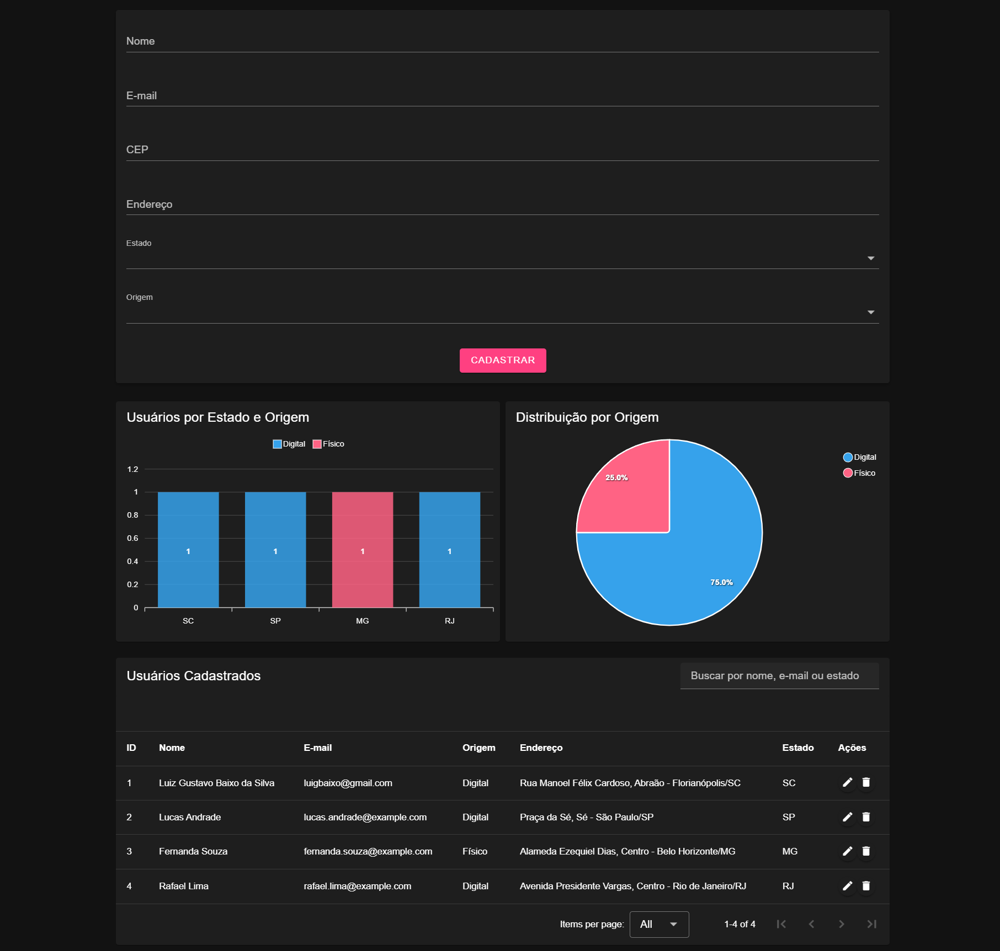
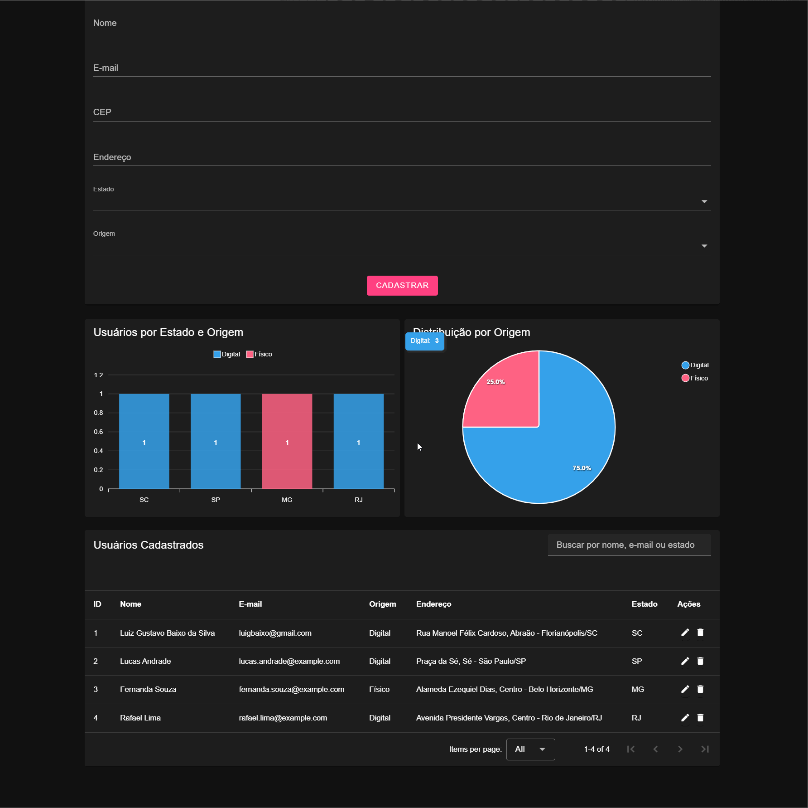

# Desafio Técnico - AAWZ Partners

Este projeto é um sistema de cadastro de usuários com painel administrativo. Permite cadastrar, editar, excluir e listar usuários, além de visualizar estatísticas com gráficos.

## ✨ Tecnologias Utilizadas

- [Vue 3](https://vuejs.org/)
- [Vuetify 3](https://vuetifyjs.com/)
- [Pinia](https://pinia.vuejs.org/)
- [Axios](https://axios-http.com/)
- [ApexCharts](https://apexcharts.com/)
- [Vite](https://vitejs.dev/)
- [Vitest](https://vitest.dev/)
- [ViaCEP API](https://viacep.com.br)

## 📸 Preview da Interface

### Formulário e Painéis


### Visualização em GIF


## ⚙️ Funcionalidades

- Cadastro de usuários com validação e consulta automática de endereço via CEP.
- Edição e exclusão de usuários com feedback visual.
- Busca por nome, e-mail ou estado.
- Paginação e exibição em tabela.
- Gráficos dinâmicos com dados por estado e origem.

## 🧪 Testes

- Testes unitários com [Vitest](https://vitest.dev/)
- Cobertura básica de regras de validação e estrutura do formulário.

Execute os testes com:

```bash
npx vitest run
```

## ▶️ Executando o Projeto

### Backend
```bash
cd backend
npm install
node server.js
```

### Frontend
```bash
cd frontend
npm install
npm run dev
```

O sistema estará disponível em `http://localhost:5173`.

## 🗃️ Estrutura

```
├── backend
│   ├── db.json
│   └── server.js
├── frontend
│   ├── src
│   │   ├── components
│   │   ├── services
│   │   ├── stores
│   │   └── tests
│   └── vite.config.js
```